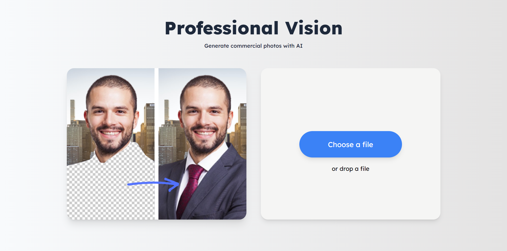
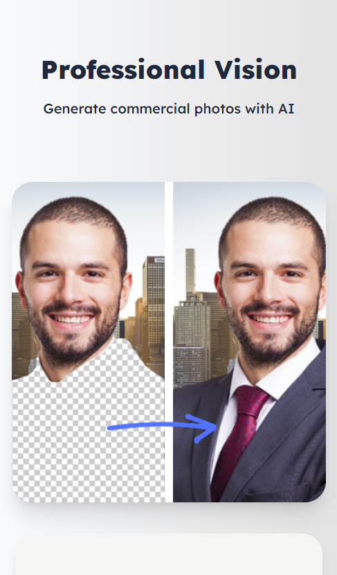

# Professional Vision


### About

Welcome to Professional Vision, your AI-Powered Commercial Photo Generator! ✨

This innovative application seamlessly blends the magic of AI with the convenience of personalized design, offering a unique solution to transform your casual photos into high-quality, professional images.

### Index

- <a href="#layout">Layout</a>
- <a href="#requirements">Requirements</a>
- <a href="#demonstration">Demonstration</a>
- <a href="#technologies-used">Technologies used</a>

### Layout

<p align="center">
  
</p>

<p align="center">
  
</p>

### Requirements

Before getting started, make sure your machine has the following tools: [Git](https://git-scm.com/), [Node.js](https://nodejs.org/en). It is important to have a code editor too, such as [VSCode](https://code.visualstudio.com/).

```bash
# Clone this repository
$ git clone https://github.com/eduvarjaor/professional-vision.git

# Access project folder
$ cd professional-vision

# Install dependencies
$ pnpm i

# Execute the backend in development mode
$ pnpm run start

# Execute the frontend in development mode
$ pnpm run dev

# The server will open on port:5173 - access http://localhost:5173/
```

### Demonstration

[Professional Vision](https://professionalvision.netlify.app/)

### Technologies used

The project uses these tools:

1. [React.js](https://legacy.reactjs.org/)
2. [Typescript](https://www.typescriptlang.org/docs/)
3. [TailwindCSS](https://tailwindcss.com/)
4. [Node.js](https://nodejs.org/en)

---

Made with 💙 by eduvarjaor 👋 [See my LinkedIn](https://www.linkedin.com/in/eduvarjaor/?locale=en_US)
